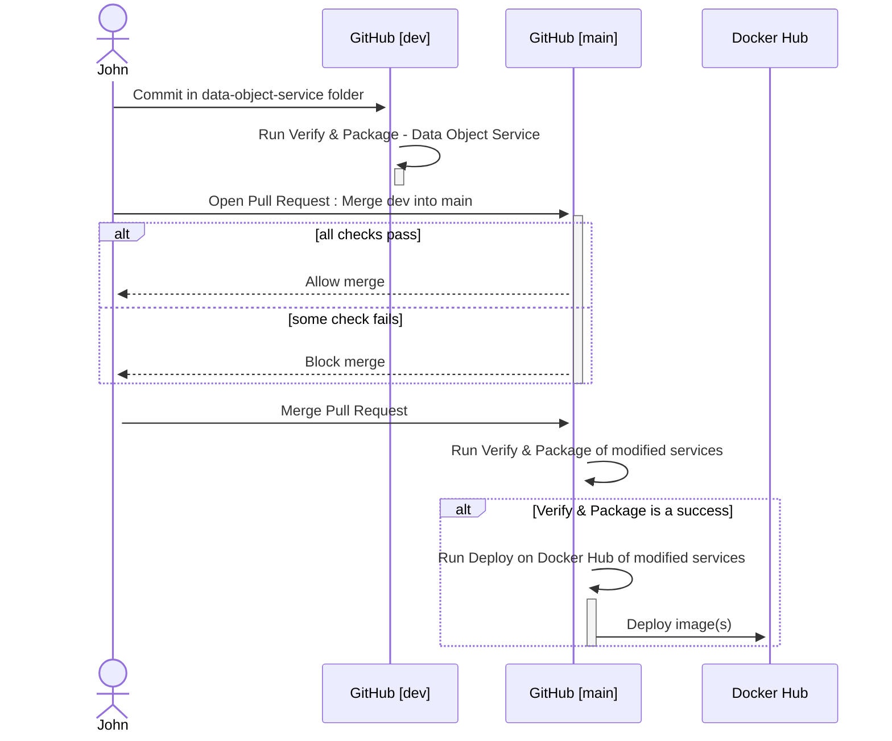

# Labelize

<div align="center">
  
</div>

## Collaborateurs

### Product Owners

- **[Nicolas Glassey](https://github.com/NicolasGlassey)** : Enseignant pour le cours AMT à l'HEIG-VD

- **[Adrien Allemand](https://github.com/AdrienAllemand)** : Assistant pour le cours AMT à l'HEIG-VD

### Développeurs

- **[Jonathan Friedli](https://github.com/Marinlestylo)** : Etudiant en troisième année à l'HEIG-VD en ingénierie logicielle. Responsable du micro-service de labelisation d'images.

- **[Lazar Pavicevic](https://github.com/Lazzzer)** : Etudiant en troisième année à l'HEIG-VD en ingénierie logicielle. Responsable du micro-service de data-objects.

## Description

Labelize est une application révolutionnaire permettant de détecter des labels sur une image fournie. Il s'agit d'une application découpée en plusieurs micro-services. De plus, cette application est conçue afin d'être capable d'utiliser plusieurs providers clouds pour la reconnaissance d'images et le stockage des données.

Ce projet est la version micro-service de [PictureLabelizer](https://github.com/AMT-TEAM07/PictureLabelizer).

## Wiki

Le [wiki](https://github.com/AMT-TEAM07/Labelize/wiki) du projet regroupe toutes les informations nécessaires pour comprendre notre méthodologie de travail, nos choix et la documentation utilisée pour implémenter notre projet.

## Providers cloud supportés

- [x] [AWS](https://aws.amazon.com/fr/)
- [ ] [Azure](https://azure.microsoft.com/fr-fr/)
- [ ] [Google Cloud](https://cloud.google.com/?hl=fr)

## Structure du projet et du repository

Le repository de l'application contient plusieurs projets mais n'est pas pour autant un vrai monorepo avec des librairies/modules partagés. Chaque projet est un micro-service totalement indépendant.

Nous avons fait le choix de ne pas utiliser de modules Maven car nous avons estimé que leur utilisation créait une dépendance allant à l'encontre de l'idée de micro-services isolés et auto-suffisants. De plus, cela nous semblait pas nécessaire pour un projet de cette taille.

Nous retrouvons 3 projets distincts dans le repository:

- `data-object-service`: Micro-service gérant le stockage des data-objects dans des [buckets S3](https://aws.amazon.com/fr/s3/) et offrant une API REST.

- `label-detector-service`: Micro-service gérant la détection des labels sur une image en utilisant [AWS Rekognition](https://aws.amazon.com/fr/rekognition/) et offrant une API REST.

- `cli-client`: Micro-service faisant le lien entre les deux autres micro-services en utilisant leur API REST. Ici, il s'agit simplement d'un exécutable JAR qui lance 3 scénarios de tests.

Ainsi que le dossier `docker-compose` qui contient un fichier `docker-compose.prod.example.yml` qu'il est possible de copier et compléter pour lancer l'environnement de production sur votre machine.

## CI/CD

La CI/CD est gérée par des GitHub Actions. Chaque micro-service possède deux workflows.

Tout d'abord, au niveau de la CI, un workflow `Verify & Package` s'occupe de lancer les tests unitaires du code et de vérifier la compilation du build de production. Ce workflow est lancé à chaque commit sur la branche `dev` et sur chaque pull request vers la branche `main`. En spécifiant le `path` dans le fichier de configuration, nous nous assurons que le workflow ne s'exécute que si des fichiers du micro-service ont été modifiés.

Ensuite, pour la CD, un workflow `Deploy` s'occupe de construire et de déployer les images Docker sur [Docker Hub](https://hub.docker.com/). Ce workflow est particulier car il ne se lance que si le workflow `Verify & Package` est un succès dans la branche `main`. Nous nous assurons de cette dépendance en utilisant la propriété `workflow_run` ainsi que le check `if: ${{ github.event.workflow_run.conclusion == 'success' }}` dans le fichier de configuration des actions.

Pour imager notre workflow, voic un exemple complet d'exécution lors d'un commit sur dev et d'une pull request sur main:



## Prérequis

- [Docker](https://docs.docker.com/get-docker/)
### Pour AWS

#### Outils à installer :

- AWS CLI
  - [AWS CLI Installation](https://docs.aws.amazon.com/cli/latest/userguide/getting-started-install.html)
  - [AWS CLI Configuration](https://docs.aws.amazon.com/cli/latest/userguide/getting-started-quickstart.html)
## Mises en routes locales

Afin de simplifier la mise en route locale des micro-services, nous avons créé un README dédié à chacun d'entre eux. Vous pouvez les consulter en cliquant sur les liens suivants:

- [Mise en route de la partie data-object-service](https://github.com/AMT-TEAM07/Labelize/tree/main/data-object-service/README.md)
- [Mise en route de la partie label-detector-service](https://github.com/AMT-TEAM07/Labelize/tree/main/label-detector-service/README.md)
- [Mise en route de la partie cli-client](https://github.com/AMT-TEAM07/Labelize/tree/main/cli-client/README.md)

## Mise en route avec Docker Compose

Une fois que vous avez complété le fichier `docker-compose.prod.example.yml`, vous pouvez lancer l'environnement de production en utilisant la commande suivante:

```bash
docker-compose -f docker-compose.prod.example.yml up
```

Puis, une fois que les deux services Spring Boot se sont initialisés, vous pouvez lancer le client en utilisant la commande suivante:

```bash
docker compose -f docker-compose.prod.yml run --rm --no-deps cli-client
```

Cela permet de lancer le client dans un container Docker et de supprimer le container une fois que le client a terminé son exécution.